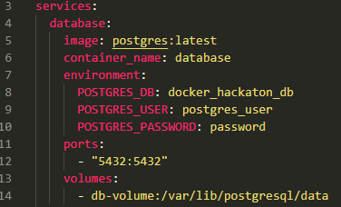

# Hackathon: Docker compose for local development
This first Hackathon of the month will be focusing on learning the basics of using Docker Compose and how to setup a basic working local development environment for a Next.js project. We'll learn how Docker works and how to use it for this scenario!

## Setup
You will need the following installed and ready on your computer beforehand:
- Docker and Docker compose from https://docs.docker.com/get-docker/
- A clone of this repository

## Steps
1. Open up Docker Desktop and notice that you (probably) have no containers, images or volumes active

2. Open up a new terminal in the root of this repository (the same folder where you can find the `docker-compose.yml` file) and write the follwing command: `docker compose up`

3. Wait for the database and Next project to finish their setup, it should say `app       |  ✓ Ready in <time>ms` in the terminal once Next is ready

4. Navigate to http://localhost:3000 and admire the beutiful page. Then nagivate to the `Register` page and try setting up a new user

5. `app       | The table 'public.User' does not exist in the current database.` Bummer, it looks like the database is only started, but no tables has been created by Prisma. To fix this, let's first shutdown our containers by exiting using Ctrl + C. Now run `docker compose up -d database` to just start the Posgres database container. Notice the `-d` flag, which means that this container should be started in `detached` mode, meaning it isn't using your terminal window anymore to run, neat!

6. Then run `docker compose run --rm app npm run update-db` to run the migrations scripts that Prisma has generated for us, it should be pretty fast. Notice the `--rm` which makes sure that this is a one-time run of the container. The parts after `app` in this case is the NPM command we wish to run inside the Docker container, once it is started.

6. Restart the Next app container by running `docker compose up app` again and try registering a new user. Now it should work flawlessly! Now try to login and bask in the glory that is the secret hidden dashboard.

7. Very cool, now we can work 100% locally with our project. But what happens when we shutdown the containers for the day? Exit the terminal using Ctrl + C again and run `docker compose down` to terminate the containers.

8. Now restart both containers by running `docker compose up -d` to start both in detached mode and navigate back to the login page http://localhost:3000/login

9. Where you able to login using the same user you created before shutting down the containers? Wierd right, we created a user, but it doesn't seem to be there anymore. Let's investigate what happened! In the terminal, run `docker logs app` to see the current log output of the Next app. It would apear that the table `User` is gone! Why is that?

10. Lets fix the issue with the vanishing tables by mounting a volume where the database can be persisted. Do this by opening the `docker-compose.yml` file in your text editor and add the following to the `database:` section, underneath `ports:`:
```yaml
volumes:
  - db-volume:/var/lib/postgresql/data
```
Like so:



11. Shutdown the currently running database with `docker compose down` and then repeat steps 5 to 8, and notice that your user now remains even if you shutdown both containers.

12. Congratulations, you are now an expert at using Docker Compose for local development!

## Optional
If you already finished the steps above and want to try some other cool stuff:

### Magical hot reload and bind mounting
Add cool hot reload capability to your local development environment using the following information:

Add these lines to the `app:` section in the `docker-compose.yml` file:
```yaml
volumes:
  - .:/app
  - /app/node_modules
```
And these under the Next apps `environment:` section in `docker-compose.yml` file:
```yaml
CHOKIDAR_USEPOLLING: true
WATCHPACK_POLLING: true
```
Try editing the pages now without restarting the containers, it should work like magic! 

What this does is to bind and mount the current directory on the host (signified by `.`) as a folder (in this case `/app`) inside the Docker container instead of using a volume. This way, our folder inside the Docker container will always be exactly the same as the bound folder in our host computer. Very useful if you need direct access to the underlying files that the Docker container uses. 

The second part `/app/node_modules` is used to create an automatic anonymous volume by the container, in order to avoid it being potentially overridden by the `node_modules` in our bind mounted folder.

### New database, who this?
Replace the Postgres database with a MariaDb database. 

You'll have to change several things in both the `docker-compose.yml` file as well as in Prisma. More info about the MariaDb Docker image can be found here: https://hub.docker.com/_/mariadb

Hints:
- Replace the `image` part of the database container
- Remember to also change `ports` and `environment` variables
- Update the `DATABASE_URL` connection string in the app container
- Update Prismas config to reflect the change of database type in `schema.prisma`